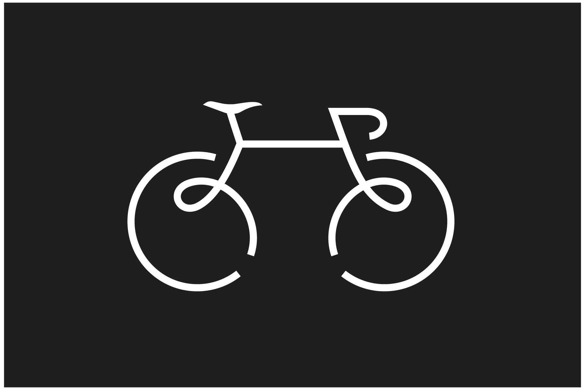

# README #

## 1 Tema/motivació. 
Explica **l’objectiu** de la web i la motivació per fer-la. Vinculació amb Geografia.

## 2 Dades/continguts. 
D’on s’han tret:

- dades, 
- text, 
- fotos, 
- etc

## 3 Estructura de la Web. 
Seccions, decisions preses en la presentació dels apartats, s’han utilitzat els elements adequats per representar la informació (taules, diagrames

## 4 Web responsive . 
Explica cóm ha fet (alguna tècnica) per a que la seva web s’adapti a *diferents dispositius*. Resolució de les imatges, etc

## 5 Cartografia . 
Cóm s’han integrat i elaborat els mapes que apareixen a la web.

## 6 Dificultats/millores. 
Reflexiona proactivament sobre el producte elaborat.

## 7 Pregunta . 
Respon a les preguntes de manera adient i utilitza el vocabulari tècnic necessari.

1. dificultat 
2. dificultat
3. dificultat

Per fer el link
[Click to google](https://www.google.com)

Una imatge d'exemple --> 

Una imatge d'exemple --> 

